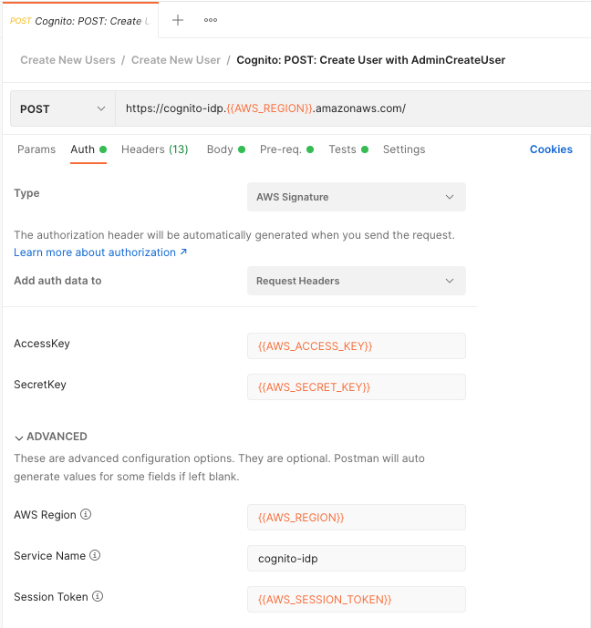
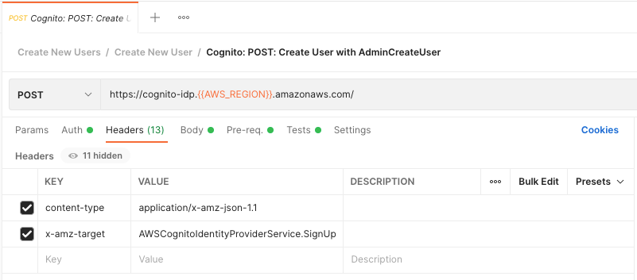
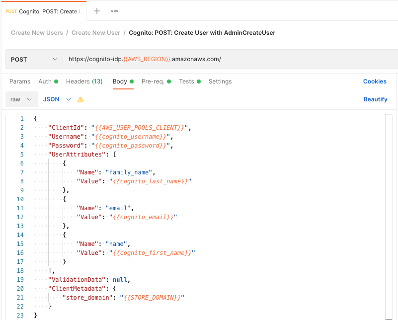
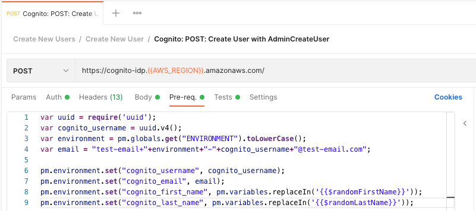

# Cognito: POST: Create User with AdminCreateUser

POST to AWS Cognito AdminCreateUser endpoint to create a new user. 

# Auth: 
Set the following variables in their Globals file. 
* <span style="color:orange">{{AWS_ACCESS_KEY}}</span> 
* <span style="color:orange">{{AWS_SECRET_KEY}}</span> 
* <span style="color:orange">{{AWS_REGION}}</span> 
* <span style="color:orange">{{AWS_SESSION_TOKEN}}</span>

Configure the Auth tab in the following manner.



# Headers:
Set the following on the Headers tab.
* content-type:application/x-amz-json-1.1
* x-amz-target:AWSCognitoIdentityProviderService.SignUp



#Body:
Set the Body tab to "raw" and "JSON" and add the following JSON. 
```json
{
    "ClientId": "{{AWS_USER_POOLS_CLIENT}}",
    "Username": "{{cognito_username}}",
    "Password": "{{cognito_password}}",
    "UserAttributes": [
        {
            "Name": "family_name",
            "Value": "{{cognito_last_name}}"
        },
        {
            "Name": "email",
            "Value": "{{cognito_email}}"
        },
        {
            "Name": "name",
            "Value": "{{cognito_first_name}}"
        }
    ],
    "ValidationData": null,
    "ClientMetadata": {
        "store_domain": "{{STORE_DOMAIN}}"
    }
}
```


#Pre-req:
Add the following to the Pre-req tab.

```javascript
var uuid = require('uuid');
var cognito_username = uuid.v4();
var environment = pm.globals.get("ENVIRONMENT").toLowerCase();
var email = "test-email+"+environment+"-"+cognito_username+"@test-email.com";

pm.environment.set("cognito_username", cognito_username);
pm.environment.set("cognito_email", email);
pm.environment.set("cognito_first_name", pm.variables.replaceIn('{{$randomFirstName}}'));
pm.environment.set("cognito_last_name", pm.variables.replaceIn('{{$randomLastName}}'));
```
Change the "email" variable's "test-email+" and "@test-email.com" to an email address you have access to.



# Notes / Sources / Thank You:
